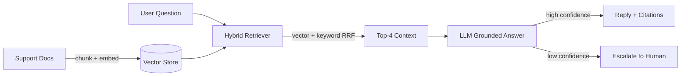

# RAG Support Agent

A production-style **Retrieval-Augmented Generation (RAG)** system that powers an AI customer-support assistant: chat with your knowledge base, get grounded answers with source citations, and **escalate automatically** to a human when the bot lacks confidence.

Built to answer the two most common AI-Automation interview questions directly:
**"Explain a RAG system you built"** and **"How do you measure whether it actually works?"**

[](https://github.com/mzpakistani9-commits/rag-support-agent/actions)
[](https://mzubair-dh-rag-support-agent.hf.space)
[](https://rag-support-agent.onrender.com)

---

## What it does

| Capability | Detail |
|---|---|
| Ingestion | Split any text/PDF into overlapping chunks and embed them into a vector store |
| Hybrid retrieval | **Vector similarity + keyword overlap, fused with Reciprocal Rank Fusion (RRF)** — better than pure vector search for jargon-heavy support docs |
| Grounded answers | LLM answers using ONLY retrieved context, quoting source chunks `[1][2]` |
| Auto-escalation | Low-confidence question → flags `escalated: true` and hands off to a human agent |
| Streaming | NDJSON token-by-token stream for chat-style UX |
| Eval harness | Retrieval hit@k + escalation tests against a gold Q&A set — a quality gate that fails CI-worthy baselines |

## Architecture



## Quick start

```bash
pip install -r requirements.txt
python scripts/seed.py            # ingest the sample knowledge base
uvicorn app.main:app --port 8000  # start API
```

## Live Demo

- **Interactive Docs:** [rag-support-agent.onrender.com/docs](https://rag-support-agent.onrender.com/docs) — try every endpoint live
- **HF Static Landing Page:** [mzubair-dh-rag-support-agent.hf.space](https://mzubair-dh-rag-support-agent.hf.space) — overview + architecture

> **Deploy yourself:** click [](https://render.com) and connect this repo — `render.yaml` configures the free-tier deployment.

```bash
# Ask a question (no LLM key needed — falls back to extractive answer)
curl "http://localhost:8000/ask?question=how%20long%20does%20standard%20shipping%20take%3F"

# Ingest your own document
curl -X POST http://localhost:8000/ingest \
  -H "Content-Type: application/json" \
  -d '{"doc_id": "faq", "text": "Your document text here..."}'

# Stream the answer token-by-token
curl "http://localhost:8000/ask/stream?question=what%20are%20the%20rate%20limits"
```

### Switch to real embeddings + a real LLM

```bash
export EMBEDDING_PROVIDER=openai
export OPENAI_API_KEY=sk-...
export EMBEDDING_MODEL=text-embedding-3-small
export OPENAI_MODEL=gpt-4o-mini
```

No API key? The pipeline runs fully offline with a deterministic hash embedder: retrieval ranks with vector+lexical fusion, and the fallback answers **extractively from the top chunk** when a lexically-relevant chunk is found, escalating only when nothing relevant matched. So the demo and tests run in CI with zero secrets — but plug in `OPENAI_API_KEY` for true semantic grounding + LLM answers.

## Endpoints

| Method | Path | Purpose |
|---|---|---|
| `GET` | `/health` | Status + provider info |
| `POST` | `/ingest` | Add/replace a document (`doc_id` + `text`) |
| `GET` / `POST` | `/ask` | Answer a question with sources + escalation flag |
| `GET` | `/ask/stream` | Token-streamed answer (NDJSON) |

## Eval harness

```bash
python scripts/evaluate.py
```

Runs 16 gold question→document pairs through the retriever and prints:

```
Retrieval hit@k: 100%
Correct escalation for out-of-KB questions: 2/2
Quality gate: PASS
```

The gate (`hit@k ≥ 80%`, all out-of-KB questions escalated) is the **measurable result** — the same rigor an automation team wants: you don't ship a workflow and hope, you measure it and gate it.

## Why it's relevant to AI Automation roles

- **RAG / LLM apps** — the #1 AI-Automation interview topic, fully implemented (ingestion → retrieval → generation)
- **Customer-support automation** — the JD's core use case, with **auto-escalation to humans** baked in
- **APIs & webhooks** — FastAPI REST + streaming endpoints
- **Measurable reliability** — an eval suite with a quality gate, mirroring how you'd validate any production automation
- **Bring it to life in an interview** — screen-share it, ingest a real doc, show the escalation fire on a question the KB can't answer

## Stack

FastAPI · ChromaDB · OpenAI embeddings (optional) · OpenAI chat (optional) · RRF hybrid retrieval · pypdf · GitHub Actions CI

## Configuration

| Env var | Default | Purpose |
|---|---|---|
| `CHROMA_DIR` | `./chroma_db` | Vector store location |
| `EMBEDDING_PROVIDER` | `local` | `local` (offline) or `openai` |
| `OPENAI_API_KEY` / `OPENAI_MODEL` | — / `gpt-4o-mini` | LLM grounding (optional) |
| `CHUNK_SIZE` / `CHUNK_OVERLAP` | `600` / `80` | Chunking budget |
| `TOP_K` | `4` | Context passages per query |
| `FETCH_K` | `12` | Wider candidate pool fused by RRF (prevents keyword-relevant chunks being dropped by coarse hash vectors) |
| `ESCALATION_THRESHOLD` | `0.62` | Semantic mode: similarity below this → escalate (`OPENAI_API_KEY` set) |
| `OFFLINE_ESCALATION_THRESHOLD` | `0.2` | Offline mode: lexical overlap below this → escalate |
| `USE_HYBRID` | `1` | Toggle keyword+vector fusion |